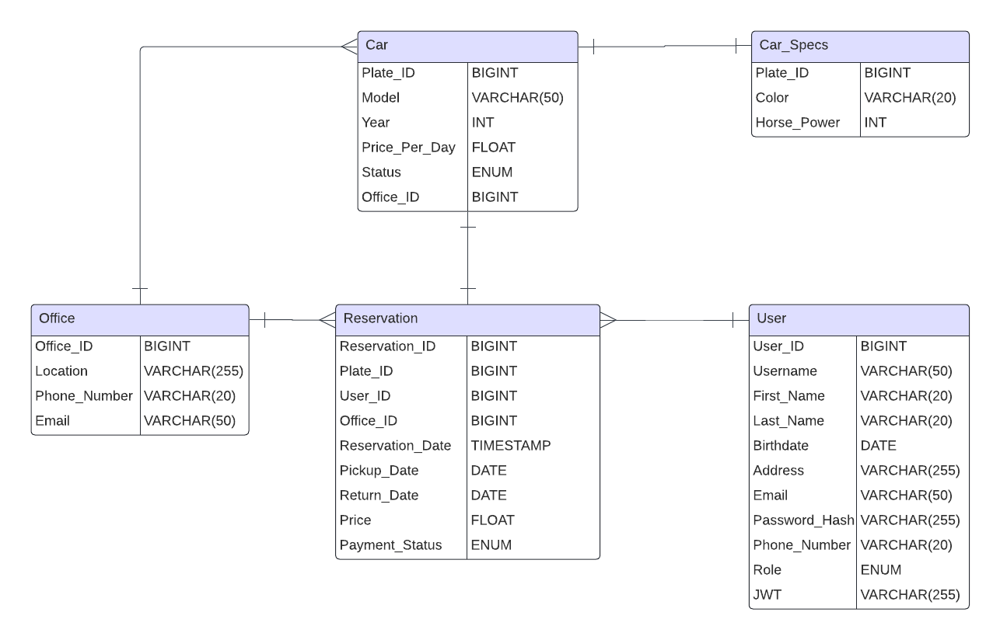

# CSE376 Database Systems: Final Project
## Database
### Schema - ERD
<!-- car(<u>plate_id</u>,model,year,price_per_day,status,office_id) 
car_specs(<u>plate_id</u>,color,horse_power) 
user(<u>user_id</u>,username,first_name,last_name,birth_date,address,email,password_hash,phone_number,role) 
office(<u>office_id</u>,location,phone_number,email) 
reservation(<u>reservation_id</u>,plate_id,user_id,office_id,pickup_date,return_date,price,payment_status) 
### Entity Relation Diagram -->

